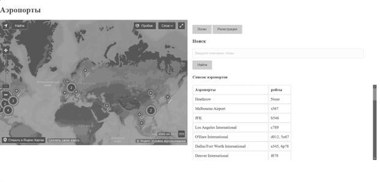

# FlaskSiteAirl
Веб-сайт с Яндекс.Картой и субд SQLite c регистрацией и добавлением в базу даныых рейсов самолетов.

# Обзор приложения
Приложение представляет собой сайт Flask с подключенной картой от Яндекс, который учитывает рейсы перелетов самолетов в аэропортах.

Список с рейсами (связей) и аэропортов (узлов) отметки на Яндекс.картах.

Можно добавить новый аэропорт (узел) через интерфейс прямо на карту, указав его координаты и привязанный к нему рейс.

